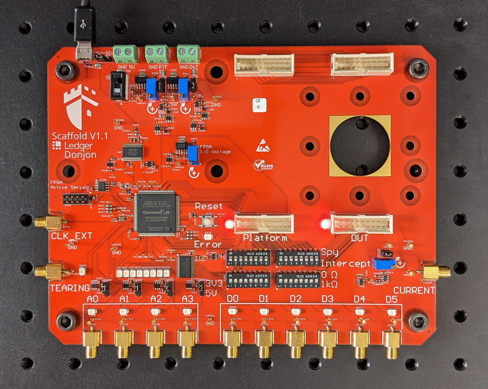

# Board status

Scaffold v1 board is currently a prototype and have a few issues we are
currently fixing. We are planning to release the v1.1 board very soon to fix
those and have a stable version:

- Adjustable voltage regulators rework (critical): current voltage regulators
  are not routed correctly and requires patching in order to work. The feedback
  resistors must be swaped, and the ceramic output capacitors must be replaced
  by tantalum ones to fix stability problems.
- Daughter-boards sockets connectors will be replaced with standard HE10
  connectors. Current connectors tends to break, are expensive and hard to
  "hack".
- Glitching protection resistors value change from 10 kOhm to 1 kOhm.
- SMA connectors mechanical change for better test points accessibility.
- C0 and C1 outputs removal to reduce board size.
- On-board programmable pull-up or pull-down resistors for D0, D1 and D2.
- And other minor improvements...

# Scaffold

Scaffold is an electronic motherboard designed for security evaluation of
integrated circuits and embedded platforms. The board can be controlled through
USB using the Python3 API, enabling easy automation of tests.

The FPGA architecture runs at 100 MHz and embeds many peripherals:

- UART,
- I2C (master),
- ISO7816 (master),
- Power supply controllers for each evaluation socket,
- Delay and pulse generators with 10 ns resolution
- And more to come in the future!

The board also integrates an 11X analog amplifier with 200 MHz bandwidth for
power measurement. The on-board shunt resistor can be tuned from 0 to
100 Ohms.

Scaffold is able to operate from 1.5V to 3.3V devices: power supplies and I/O
bank voltage can be tuned thanks to adjustable voltage regulators. Scaffold can
be powered from USB or external power supplies.

Six special I/Os can generate 5V pulses, which are compatible with
*ALPhANOV PDM* laser sources (50 Ohm TTL).

## Documentation

API documentation is available on [Read the Docs](https://donjonscaffold.readthedocs.io).

## Licensing

Scaffold is released under GNU Lesser General Public Licence version 3 (LGPLv3).
See COPYING and COPYING.LESSER for license details.

